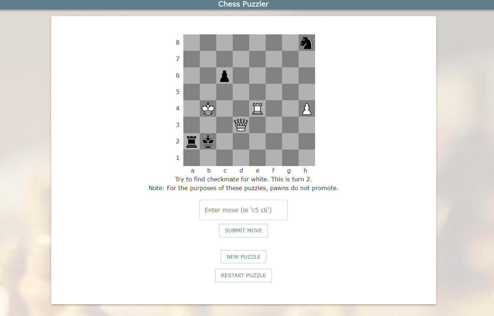
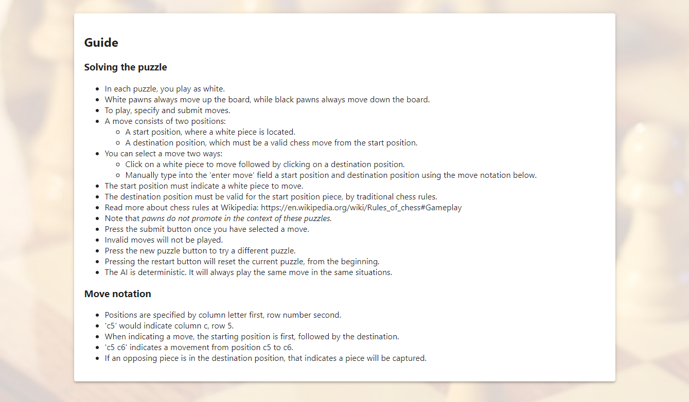

# Chess Puzzler
*By Sean McLaughlan - [Visit Chess Puzzler](https://chesspuzzler.herokuapp.com/)*

- [Chess Puzzler](#chess-puzzler)
  - [Chess Puzzler at a Glance](#chess-puzzler-at-a-glance)
    - [Frontend (React)](#frontend-react)
    - [Backend (Node)](#backend-node)
      - [Chess Logic](#chess-logic)

## Chess Puzzler at a Glance

Chess Puzzler presents chess puzzles for users to solve. The puzzles are randomly generated.

### Frontend (React)

The interface uses MaterialUI in combination with CSS.



The guide covers users interaction.



### Backend (Node)

A Node Express server handles requests for a new puzzle as well as AI responses to player moves.
#### Chess Logic

Before creating a piece, the relative positions it can move to need to be tracked. The King's moves, for example:

```js
const kMoves = [
  {
    moveTo: [-1, -1],
  },
  {
    moveTo: [-1, 0],
  },
  {
    moveTo: [-1, 1],
  },
  {
    moveTo: [0, 1],
  },
  {
    moveTo: [1, 1],
  },
  {
    moveTo: [1, 0],
  },
  {
    moveTo: [1, -1],
  },
  {
    moveTo: [0, -1],
  },
];
```

Pieces are created by using a createPiece function which returns a piece object. The piece's functions check if it can attack certain positions, or the opposing team's king.

```js
/**
 * Returns true if the piece is attacking the posArr [x, y].
 * @param {Object} bd - board
 * @param {Arr} posArr - [x, y]
 * @return {Boolean}
 */
function isAttackingPosition(bd, posArr) {
  const [x, y] = posArr;
  const validMoves = this.getValidMoves(bd, true);
  for (const move of validMoves) {
    const { endPosX, endPosY, notAttack } = move;
    if (notAttack === true) continue;
    if (x === endPosX && y === endPosY) return true;
  }
  return false;
}


/**
 * Returns true if piece puts opponent King in check.
 * @param {Object} bd - board that piece is on
 * @return {Boolean}
 */
function isAttackingOpponentKing(bd) {
  const validMoves = this.getValidMoves(bd, false);
  for (const move of validMoves) {
    const { endPosX, endPosY, notAttack } = move;
    if (!notAttack) {
      const endPos = bd.board[endPosX][endPosY];
      if (
        endPos?.pieceType === "k" &&
        endPos?.color !== this.color
      ) {
        return true;
      }
    }
  }

  return false;
}
```

With the pieces defined, the board object can make use of them.

```js
/**
 * Adds piece to the board.
 * @param {Number} x
 * @param {Number} y
 * @param {String} color - 'w' or 'b'
 * @param {String} pieceType - 'p', 'k', etc.
 */
function addPiece(x, y, color, pieceType) {
  if (this.board[x][y] === undefined) {
    console.log(
      "Invalid placement of piece. Piece not added."
    );
    return;
  }

  if (
    this.board[x][y] !== undefined &&
    this.board[x][y] !== "____"
  ) {
    // Adding into a position with a piece already
    // so remove that piece first.
    this.removePiece(x, y);
  }

  const piece = createPiece(pieceType, color, x, y);
  this.board[x][y] = piece;
  if (color === "w") {
    this.wPieces.push(piece);
    this.wScore += piece.pieceValue;
    this.bScore -= piece.pieceValue;
  } else if (color === "b") {
    this.bPieces.push(piece);
    this.wScore -= piece.pieceValue;
    this.bScore += piece.pieceValue;
  }
}
```

```js
/**
 * Returns true if color side King is in check.
 * @param {String} color - 'w' or 'b'
 * @return {Boolean}
 */
function isInCheck(color) {
  let pieces;
  if (color === "w") {
    pieces = this.bPieces;
  } else if (color === "b") {
    pieces = this.wPieces;
  }
  for (const piece of pieces) {
    if (piece.isAttackingOpponentKing(this)) {
      return true;
    }
  }
  return false;
}
```
